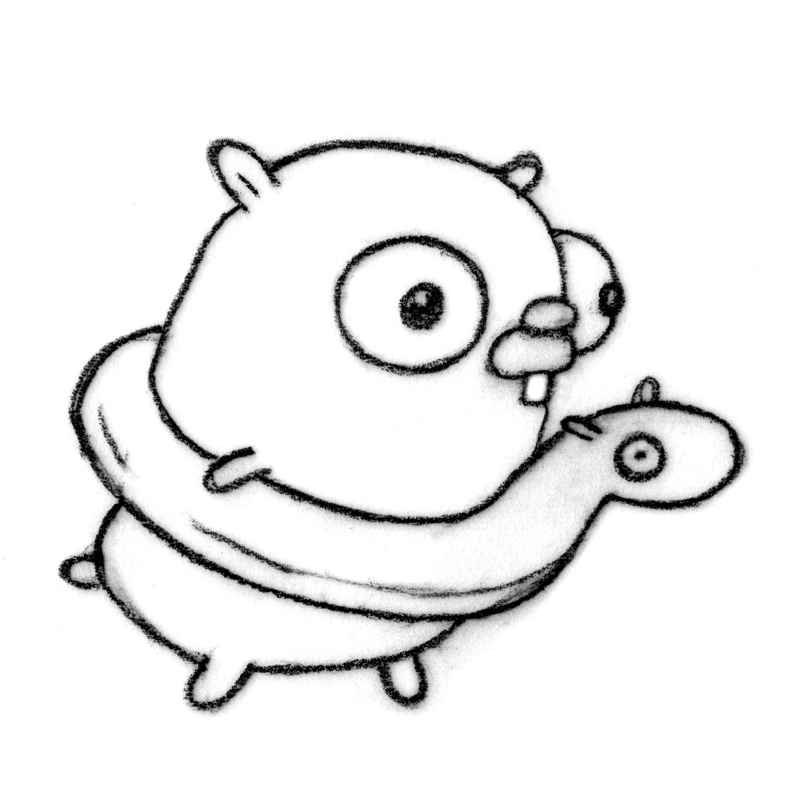
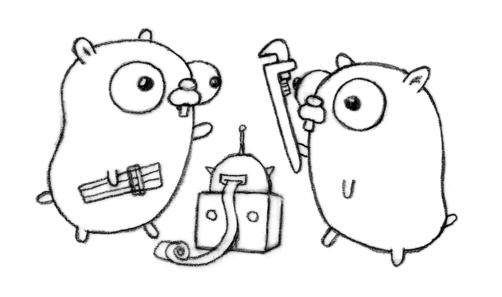

# [fit] Crossing the
# [fit] language chasm
-
-
### David Calavera

---

## Principles and Progress in the Construction of High-Speed Digital Computers

### -- Andrew D. Booth and Kathleen H. V. Britten

^I'd like you to meet Kathleen Booth. Birkbeck College, University of London. She's the creator of the first assembly language, back in 1947.

---

---

---
-
-

# The best way to get those initial twenty users is to give people an application they want, which happens to be written in the new language. [^1]
-
-
-
-
-- Paul Graham

[^1]: http://www.paulgraham.com/popular.html

---

---
# [fit] User Driven Design
-
# One of the most important lessons about crossing the chasm is that the task ultimately requires achieving an unusual degree of company unity during the crossing period.[^2]

-- Geoffrey A. Moore

[^2]: https://en.wikipedia.org/wiki/Crossing`_`the`_`Chasm

---

# [fit] User Driven Design
-
# The very existence of a master plan means, that the members of the community can have little impact on the future shape of their community, because most of the important decisions have already been made.[^3]

-- Christopher Alexander

[^3]: https://en.wikipedia.org/wiki/The`_`Oregon`_`Experiment

---

# [fit] User Driven Design
-
# Only the people can guide the process of organic growth in a community. They know the most about their own needs, and they know most about how well or how badly the rooms and buildings, paths and open spaces are working.[^3]

-- Christopher Alexander

---
# [fit] User Driven Design
-
-
-
# [fit] https://github.com/golang/proposal

---

---
# [fit] Simplicity VS Goodness
-
-
# Ultimately, it does not matter how simple or complex something is. The only question is whether the thing is any good.[^4]

-- Dan Ward

[^4]: The Simplicity Cycle: A Field Guide to Making Things Better Without Making Them Worse.

---
# [fit] Simplicity VS Goodness
-
-
-
# [fit] golang.org/pkg/html/template

---
# [fit] Simplicity VS Goodness
-
-
-
# [fit] go get github.com/constabulary/gb/...

---
# [fit] Simplicity VS Goodness
-
### github.com/golang/tools
## vs
### github.com/fatih/vim-go
## vs
### [fit] github.com/go-lang-plugin-org/go-lang-idea-plugin

---

---

# [fit] Patterns
-
# A general planning principle, which states a clear problem that may occur repeatedly in the environment, states the range of contexts in which this problem will occur, and gives general features required which solve this problem.[^3]
-
-- Christopher Alexander

---

# [fit] Patterns
-
# We may regard a pattern as an empirically grounded imperative, which states the preconditions for healthy individual and social life in a community.[^3]
-
-
-
-- Christopher Alexander

---
# [fit] Patterns
-
# Go can be the most inclusive community in the tech industry.[^6]
-
-
-
-
-
-- Andrew Gerrand

[^6]: https://sourcegraph.com/blog/live/gophercon2015/123748269730

---
# [fit] Patterns
-
# The early adopters set the tone for a community in ways that are often difficult to change.[^5]
-
-
-
-
-
-- Betsy Haibel

[^5]: https://modelviewculture.com/pieces/the-life-cycle-of-programming-languages

---

# [fit] Be patient
# [fit] Be helpful
# [fit] Be kind

---
-
-
# [fit] Thank you
-
-
-
### @calavera
